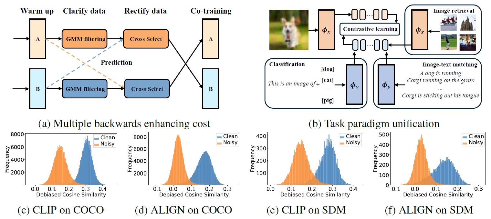
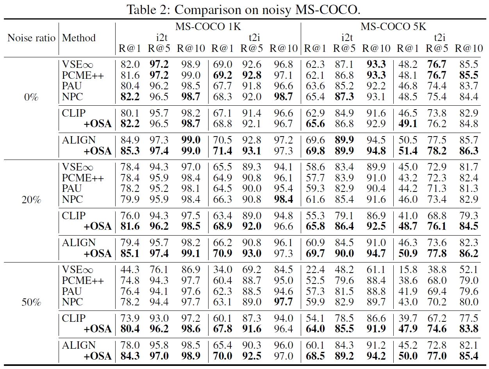

<div align=center>

<h1>One-step Noisy Label Mitigation</h1>


<a href="LICENSE">

</a>

<div>
      <a href="https://leolee99.github.io/" target="_blank">Hao Li</a><sup>1</sup><sup>*</sup>,
      <a href="https://github.com/jkdxg8837" target="_blank">Jiayang Gu</a><sup>1</sup><sup>*</sup>,
    <a href="https://cfm.uestc.edu.cn/~songjingkuan/" target="_blank">Jingkuan Song</a><sup>1</sup><sup>&dagger;</sup>,
    <a href="https://anzhang314.github.io/" target="_blank">An Zhang</a><sup>2</sup>,
      <a href="https://lianligao.github.io/" target="_blank">Lianli Gao</a><sup>1</sup>,

<div>
  <sup>1</sup>University of Electronic Science and Technology of China
       </div>   
  <sup>2</sup>National University of Singapore
</div>


<p align="center" style="overflow:hidden;">
 
</p>

</div>

The official implementation of the paper **"[One-step Noisy Label Mitigation](https://arxiv.org/pdf/2410.01944)"**.

<p id="Preparations"></p>  

## Requirements
We recommend the following dependencies.

* Python 3.8
* [PyTorch](http://pytorch.org/) 1.13.1

Then, please install other environment dependencies through:
```bash
pip install -r requirements.txt
```

The recommended GPU memory is at least 24 GB.

## ⚙️ Dataset Preparation

#### Annotation Preparation

We follow the same split provided by [NPC](https://arxiv.org/pdf/2312.05777).

You should first download and extract the formulated datasets directory, which contains all the annotation files. You can access them [here](https://drive.google.com/file/d/179Pv6A-qvfAaBc0_Wz45pEfJjwKYnQ5i/view?usp=sharing).

Our formulated datasets directory tree looks like:
```
${DATASETS}/
├── MSCOCO/
│    ├── annotations/
│    │       ├── 0.0_clean_index.npy
│    │       ├── 0.0_noise_train_caps.txt
│    │       ├── 0.2_clean_index.npy
│    │       ├── ...
│    │       ├── train_caps.txt
│    │       ├── train_ids.txt
│    │       ├── dev_caps.txt
│    │       └── ...
│    └── images/ # empty
│
├── Flickr30K/
│    ├── annotations
│    │       ├── 0.0_clean_index.npy
│    │       ├── 0.0_noise_train_caps.txt
│    │       ├── 0.2_clean_index.npy
│    │       ├── ...
│    │       ├── train_caps.txt
│    │       ├── train_ids.txt
│    │       ├── dev_caps.txt
│    │       └── ...
│    └── images/
│
└── CC120K/
     ├── annotations
     │       ├── train_caps.txt
     │       ├── train_ids.txt
     │       ├── dev_caps.txt
     │       └── ...
     └── images/ # empty

```

#### Image Preparation

The images directory are still empty. You need to download the images separately and place them directly in the corresponding dataset's images folder. We adopt the same image download and processing method as [NPC](https://github.com/ZhangXu0963/NPC?tab=readme-ov-file#split-dataset).

**Download Link**
* **[MSCOCO](https://cocodataset.org/#home)**. We unified the images' name format of the MSCOCO dataset for easier use. You can use `util.py` to rename the images in MSCOCO.
* **[Flickr30K](https://shannon.cs.illinois.edu/DenotationGraph/data/index.html)**.
* **[CC120K](https://pan.baidu.com/s/152gNGgScGSMgSXu8i8o-dg).** You can download the dataset from this [link](https://pan.baidu.com/s/152gNGgScGSMgSXu8i8o-dg) with the extraction code "3ble".


## 🔥 Training
The following are the training instructions for various datasets. Please set the ```${DATASETS}``` to previously configured datasets folder. You can specify the ```${SAVE_PATH}$``` to the model path you'd like to save to.

**Training on MS-COCO:**
 You can adjust the noise ratio in the training set by changing ```${NOISE_RATIO}$```, which can be selected from the following values: [0.0, 0.2, 0.4, 0.5, 0.6].

```bash
python main_clip.py --batch_size 256 --epochs 5 --lr 1e-5 --warmup 500 --vision_model ViT-B/32 --dataset coco --dataset_root ${DATASETS}$/MSCOCO --checkpoint_path ${SAVE_PATH}$ --noise_ratio ${NOISE_RATIO}$
```

**Training on Flickr30K:**

 You can adjust the noise ratio in the training set by changing ```${NOISE_RATIO}$```, which can be selected from the following values: [0.0, 0.2, 0.4, 0.6].

```bash
python main_clip.py --batch_size 256 --epochs 5 --lr 1e-5 --warmup 500 --vision_model ViT-B/32 --dataset f30k --dataset_root ${DATASETS}$/Flickr30K --checkpoint_path ${SAVE_PATH}$ --noise_ratio ${NOISE_RATIO}$
```

**Training on CC120K:**

CC120K is a real-world noisy dataset, so the noise ratio is not need to be specified.

```bash
python main_clip.py --batch_size 256 --epochs 10 --lr 1e-5 --warmup 500 --vision_model ViT-B/32 --dataset cc --dataset_root ${DATASETS}$/CC120K --checkpoint_path ${SAVE_PATH}$
```

## 📋 Evaluation

### Experimental Results

<p align="center" style="overflow:hidden;">
 
</p>

### Evaluation Instuctions

You can evaluate your trained model by executing the following commands. Please set the ```${DATASETS}``` to previously configured datasets folder. ```${MODEL_PATH}$``` is the model to be evaluated.

**Evaluation on MSCOCO:**

```bash
python main_clip.py --eval --vision_model ViT-B/32 --dataset coco --dataset_root ${DATASETS}$/MSCOCO --resume ${MODEL_PATH}$
```

**Evaluation on Flickr30K:**

```bash
python main_clip.py --eval --vision_model ViT-B/32 --dataset f30k --dataset_root ${DATASETS}$/Flickr30K --resume ${MODEL_PATH}$
```

**Evaluation on CC120K:**

```bash
python main_clip.py --eval --vision_model ViT-B/32 --dataset cc --dataset_root ${DATASETS}$/CC120K --resume ${MODEL_PATH}$
```


## Reference
If you found this work is useful for you, we appreciate that if you can cite the following paper:
```
@inproceedings{OSA,
  author    = {Hao Li and
               Jiayang Gu and
               Jingkuan Song and
               An Zhang and
               Lianli Gao},
  title     = {One-step Noisy Label Mitigation},
  journal = {arXiv preprint: 2410.01944},
  year      = {2024}
}
```
